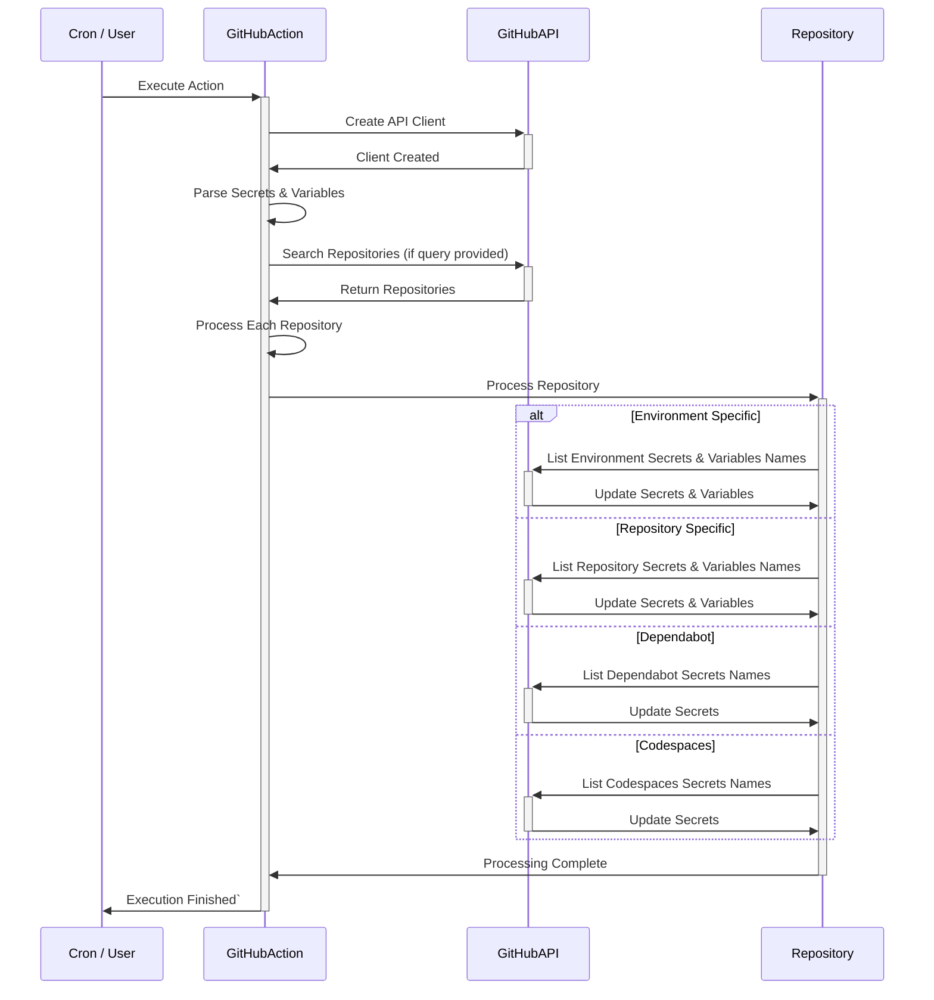

# Sync Secrets Action

**Sync Repository, Dependabot and Codespaces secrets + variables between GitHub repositories**

[](https://github.com/cbrgm/sync-secrets-action)
[](https://goreportcard.com/report/github.com/cbrgm/sync-secrets-action)
[](https://github.com/cbrgm/sync-secrets-action/actions/workflows/go-lint-test.yml)
[](https://github.com/cbrgm/sync-secrets-action/actions/workflows/go-binaries.yml)
[](https://github.com/cbrgm/sync-secrets-action/actions/workflows/container.yml)

- [Sync Secrets Action](#sync-secrets-action)
   * [Inputs](#inputs)
   * [GitHub Token Requirements](#github-token-requirements)
   * [Container Usage](#container-usage)
   * [Usage Examples](#usage-examples)
      + [Syncing Repository Secrets and Variables](#syncing-repository-secrets-and-variables)
      + [Matrix Build Example - Syncing Across Multiple Repositories](#matrix-build-example-syncing-across-multiple-repositories)
      + [Query Example - Syncing to Repositories by Search Query](#query-example-syncing-to-repositories-by-search-query)
      + [Syncing Environment Secrets](#advanced-usage-syncing-environment-secrets)
      + [Syncing Secrets Across Multiple Repositories and Environments](#sync-secrets-across-multiple-repositories-and-environments)
      + [Syncing Codespaces Secrets](#syncing-codespaces-secrets)
      + [Syncing Dependabot Secrets](#syncing-dependabot-secrets)
      + [Local Development](#local-development)
   * [High-Level Functionality](#high-level-functionality)
   * [FAQ on Security](#faq-on-security)
      + [Is it safe to use this GitHub Action for syncing secrets?](#is-it-safe-to-use-this-github-action-for-syncing-secrets)
      + [Can others see my secrets during the sync process?](#can-others-see-my-secrets-during-the-sync-process)
      + [Are my secrets protected from unauthorized access?](#are-my-secrets-protected-from-unauthorized-access)
      + [Does this action keep my secrets safe even in public repositories?](#does-this-action-keep-my-secrets-safe-even-in-public-repositories)
      + [Will using this action increase the risk of secret leakage?](#will-using-this-action-increase-the-risk-of-secret-leakage)
   * [Why yet another action?](#why-yet-another-action)
   * [Contributing & License](#contributing-license)

## Inputs

- `github-token`: **Required** - The GitHub token to use. Use GitHub secrets for security.
- `target`: Optional - The repository to sync secrets and variables to. Either `target` or `query` must be set, but not both.
- `secrets`: Optional - Secrets to sync. Formatted as a string of newline-separated `KEY=VALUE` pairs.
- `variables`: Optional - Variables to sync. Formatted as a string of newline-separated `KEY=VALUE` pairs.
- `rate-limit`: Optional - Enables rate limit checking. Set to `true` to enable. Default is `false`.
- `max-retries`: Optional - Maximum number of retries for operations. Must not be smaller than zero. Default is `3`.
- `dry-run`: Optional - Dry run mode. If true, no changes will be made. Useful for testing. Default is `false`.
- `prune`: Optional - Prunes all existing secrets and variables not in the subset of those defined. Default is `false`.
- `environment`: Optional - The GitHub environment to sync variables or secrets to. Use when targeting environment-specific secrets or variables.
- `type`: Optional - Type of the secrets to manage: `actions`, `dependabot`, or `codespaces`. Default is `actions`.
- `query`: Optional - GitHub search query to find repositories for batch processing. Either `query` or `target` must be set, but not both.

## GitHub Token Requirements

> **Note**: To use Sync Secrets Action, you need a GitHub Token with the right permissions. The default `GITHUB_TOKEN` won't work.

For a Personal Access Token (PAT), create one in your GitHub settings with `repo` and, if needed, `admin:org` permissions.

For a GitHub App token, create an app in GitHub settings, set necessary permissions, install it to target repositories, and use the private key for authentication.

Store your token in GitHub secrets and use it in the `github-token` input of the action.

## Container Usage

This action can be executed independently from workflows within a container. To do so, use the following command:

```
podman run --rm -it ghcr.io/cbrgm/sync-secrets-action:v1 --help
```

## Usage Examples

Here are some usage examples to help you getting started! Feel free to contribute more.

### Syncing Repository Secrets and Variables

```yaml
name: Sync Repository Secrets and Variables

on:
  workflow_dispatch:

jobs:
  sync-repo-secrets-and-vars:
    runs-on: ubuntu-latest
    steps:
      - name: Sync Secrets and Variables
        uses: cbrgm/sync-secrets-action@v1
        with:
          github-token: ${{ secrets.GITHUB_TOKEN }}
          target: 'user/repository'
          secrets: |
            SECRET_KEY=${{ secrets.SOME_SECRET }}
            ANOTHER_SECRET=${{ secrets.ANOTHER_SECRET }}
          variables: |
            VAR_KEY=varvalue
            ANOTHER_VAR=${{ secrets.A_VARIABLE }}

```

### Matrix Build Example - Syncing Across Multiple Repositories

```yaml
name: Sync Secrets Across Repositories

on:
  workflow_dispatch:

jobs:
  sync-secrets-across-repos:
    runs-on: ubuntu-latest
    strategy:
      matrix:
        target: ['user/repo1', 'user/repo2', 'user/repo3']
    steps:
      - name: Sync Secrets to ${{ matrix.target }}
        uses: cbrgm/sync-secrets-action@v1
        with:
          github-token: ${{ secrets.GITHUB_TOKEN }}
          target: ${{ matrix.target }}
          secrets: |
            GLOBAL_SECRET=${{ secrets.GLOBAL_SECRET }}
          variables: |
            GLOBAL_VAR=globalvarvalue
```

### Query Example - Syncing to Repositories by Search Query

```yaml
name: Sync Secrets to Repositories by Query

on:
  workflow_dispatch:

jobs:
  sync-secrets-by-query:
    runs-on: ubuntu-latest
    steps:
      - name: Sync Secrets to Repositories Matching Query
        uses: cbrgm/sync-secrets-action@v1
        with:
          github-token: ${{ secrets.GITHUB_TOKEN }}
          query: 'org:myorganization topic:mytopic'
          secrets: |
            GLOBAL_SECRET=${{ secrets.GLOBAL_SECRET }}
          variables: |
            GLOBAL_VAR=globalvarvalue
```

> This workflow uses the query argument to target repositories within `myorganization` that are tagged with the topic `mytopic`. It syncs the specified secrets and variables to all matching repositories.

See [GitHub Queries](https://docs.github.com/en/graphql/reference/queries).

### Syncing Environment Secrets

> Tip: Make sure these environments exist before distributing secrets!

```yaml
name: Sync Environment Secrets

on:
  push:
    branches:
      - main

jobs:
  sync-env-secrets:
    runs-on: ubuntu-latest
    steps:
      - name: Sync Environment Secrets
        uses: cbrgm/sync-secrets-action@v1
        with:
          github-token: ${{ secrets.GITHUB_TOKEN }}
          target: 'user/repository'
          environment: 'production'
          secrets: |
            PROD_DB_PASSWORD=${{ secrets.PROD_DB_PASSWORD }}
          dry-run: 'false'
          prune: 'true'

```

### Syncing Secrets Across Multiple Repositories and Environments

```yaml
name: Sync Secrets Across Repositories and Environments

on:
  workflow_dispatch:

jobs:
  sync-secrets:
    runs-on: ubuntu-latest
    strategy:
      matrix:
        repo: ['org/repo1', 'org/repo2', 'org/repo3'] # Target repositories
        environment: ['development', 'staging', 'production'] # Target environments
    steps:
      - name: Sync Secrets to ${{ matrix.repo }} for ${{ matrix.environment }} Environment
        uses: cbrgm/sync-secrets-action@v1
        with:
          github-token: ${{ secrets.GITHUB_TOKEN }}
          target: ${{ matrix.repo }}
          environment: ${{ matrix.environment }}
          secrets: |
            DATABASE_URL=${{ secrets['DB_URL_' + matrix.environment] }}
            API_KEY=${{ secrets['API_KEY_' + matrix.environment] }}
          type: 'actions'
          dry-run: 'false'
          prune: 'true'
```

>  The secrets input dynamically references secrets based on the environment. For example, `DB_URL_development`, `DB_URL_staging`, and `DB_URL_production` should be defined in your repository's secrets. This approach allows each job to use environment-specific secret values.

### Syncing Codespaces Secrets

```yaml
name: Sync Codespaces Secrets

on:
  workflow_dispatch:

jobs:
  sync-codespaces-secrets:
    runs-on: ubuntu-latest
    steps:
      - name: Sync Codespaces Secrets
        uses: cbrgm/sync-secrets-action@v1
        with:
          github-token: ${{ secrets.GITHUB_TOKEN }}
          target: 'user/repository'
          secrets: |
            CODESPACE_SECRET=${{ secrets.CODESPACE_SECRET }}
          type: 'codespaces'

```

### Syncing Dependabot Secrets

```yaml
name: Sync Dependabot Secrets

on:
  workflow_dispatch:

jobs:
  sync-dependabot-secrets:
    runs-on: ubuntu-latest
    steps:
      - name: Sync Dependabot Secrets
        uses: cbrgm/sync-secrets-action@v1
        with:
          github-token: ${{ secrets.GITHUB_TOKEN }}
          target: 'user/repository'
          secrets: |
            DEPENDABOT_SECRET=${{ secrets.DEPENDABOT_SECRET }}
          type: 'dependabot'
```

### Local Development

You can build this action from source using `Go`:

```bash
make build
```

## High-Level Functionality



## FAQ on Security

### Is it safe to use this GitHub Action for syncing secrets?

Yes, it is designed with safety in mind. However, like any tool, the security level depends on proper usage and configuration. Ensure your GitHub token has the minimum required permissions.

### Can others see my secrets during the sync process?

No, secrets are encrypted and handled within GitHub's secure environment. Yet, be cautious with the output logs and error messages to avoid accidental exposure.

### Are my secrets protected from unauthorized access?

Yes, they are protected using GitHub's security mechanisms. Nonetheless, the security is also contingent on how well access controls and permissions are managed in your GitHub repository settings.

### Does this action keep my secrets safe even in public repositories?

Yes, secrets are not exposed in code or logs, ensuring they remain secure. However, the inherent risk of public repositories means you should be extra vigilant in monitoring access and usage patterns.

### Will using this action increase the risk of secret leakage?

Using this action does not inherently increase risk if followed by GitHub's security guidelines and best practices. Risks mainly arise from misconfigurations or improper handling of secrets on the user's part. Regular audits and updates are recommended to maintain security.

## Why yet another action?

While building my GitHub Action for secret synchronization, I drew inspiration from existing solutions, focusing on addressing specific challenges and enhancing user experience:

- [Secrets Sync Action by @jpoehnelt](https://github.com/jpoehnelt/secrets-sync-action)
- [Secrets Sync by @xt0rted](https://github.com/xt0rted/secrets-sync)

Key design principles guiding my action development include:

- **Standardizing Inputs**: Adopting kebab-case for inputs, inspired by the conventions seen in the repositories listed.
- **Enhancing Matching Logic**: Utilizing GitHub Search syntax over regex for repository targeting.
- **Explicit Secret Specification**: Preferring direct secret naming to regex patterns for clarity and precision, addressing complexity and confusion observed in the existing actions.

## Contributing & License

* **Contributions Welcome!**: Interested in improving or adding features? Check the [Contributing Guide](https://github.com/cbrgm/sync-secrets-action/blob/main/CONTRIBUTING.md) for instructions on submitting changes and setting up development environment.
* **Free & Open**: Made during free time, costs nothing. See [Apache 2.0 License](https://github.com/cbrgm/sync-secrets-action/blob/main/LICENSE) for your rights.
* **Your Involvement Matters**: Code contributions, suggestions, feedback crucial for improvement and success. Let's maintain it as a useful resource for all 🌍.
